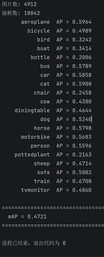

# SSD300 目标检测 — PyTorch 从零实现
本项目是个人新人练手项目：
基于 PyTorch 从零构建的 SSD300（Single Shot MultiBox Detector）目标检测模型，全程手写，无Vibe-coding。
在Pascal VOC 2007+2012 数据集上本地计算机从0完成训练，不采用预训练参数，支持 20 类目标检测。

## 项目结构

```
SSD300/
├── config.py              # 全局配置文件（类别、模型参数、训练参数、测试参数）
├── ssd_net.py             # SSD300 网络结构定义（VGG骨干 + 空洞卷积 + 辅助块 + 检测头）
├── anchors_opt.py         # 锚框核心算法（生成、匹配、编码、解码、NMS）
├── parse_data.py          # VOC XML 标注文件解析与缓存生成
├── load_data.py           # 训练数据加载器（数据增强：翻转、模糊、灰度、颜色抖动）
├── ssd_train.py           # 训练脚本（SGD + MultiStepLR + 正负样本平衡）
├── ssd_test.py            # 测试/评估脚本（mAP 计算）
├── ssd_predict.py         # 单图推理与可视化
├── checkpoint/            # 模型权重保存目录
├── VOC2007+2012训练集/    # 训练数据集（JPEGImages + Annotations），需要手动载入数据。
└── VOC2007测试集/         # 测试数据集（JPEGImages + Annotations），需要手动载入数据。
```

## 项目简介


- **项目简介**：
使用VOC2007+2012公开数据集，基于Pytorch深度学习框架，全程只用torch库，从0设计SSD300的网络架构、数据加载、锚框生成、通过IoU标注类别和偏移量、检测头、NMS非极大抑制、神经网络训练、测试等代码。
随后在GPU上从0训练网络，包括VGG16块的参数训练。采用图像翻转、改变颜色、亮度调节、焦距模糊等数据增强。重新修改原论文的超参数：如正负样本比，学习率调度器等以适应自己的数据集。最后使用mAP指标检验模型效果。
- **项目难点**：
1：为了能够在GPU上向量化并行计算，在很多地方都需要精巧的考虑如何向量化，如批量框计算IoU。
2：由于从0设计的模型VGG16块的参数是初始化的，没有了对图像纹理识别的前置条件，前期过高的正负样本比会导致模型不敢预测正样本，背景率太高。因此需要对原论文的超参数设置进行调整。如在训练前期将正负样本比减少，使得模型敢于预测正样本，随后在训练过程中逐步提高，让模型逐步认识背景的存在。
3：没有预训练的VGG16参数，VOC2007+2012的训练样本数实在太少，且正负样本比在前期太低，模型很容易过拟合。所以需要在使用数据增强的同时，使用权重衰减、暂退层、逐步将正负样本比提高。
- **项目缺点**：
1：由于设计网络时的疏忽，池化层忘记加上ceil_mode = True，导致向下取整。但是由于是从0开始训练，造成的结果仅是少了一些锚框，对小目标检测略微吃力，对mAP检测值大约降低1-3个百分点。
2：模型对VGG16做出了改动，在每层卷积后额外加上了批量规范化层，导致的结果是模型收敛较快，loss损失偏低。训练结果的loss的损失过低是正常现象，不是过拟合！
3：没有VGG16预训练参数，模型对图片的特征提取能力需要从头开始，而训练数据集明显不足，mAP效果偏低。

## 测试集mAP效果展示




## 环境要求

- Python 3.8+
- PyTorch >= 1.10.0
- torchvision >= 0.11.0
- CUDA（推荐，CPU 也可运行）


### 目录结构要求

```
VOC2007+2012训练集/
├── JPEGImages/          # 训练图片 (.jpg)
└── Annotations/         # VOC 格式标注文件 (.xml)

VOC2007测试集/
├── JPEGImages/          # 测试图片 (.jpg)
└── Annotations/         # VOC 格式标注文件 (.xml)
```

### 训练数据来源

1. **Pascal VOC 2007**: http://host.robots.ox.ac.uk/pascal/VOC/voc2007/
2. **Pascal VOC 2012**: http://host.robots.ox.ac.uk/pascal/VOC/voc2012/

将 VOC2007 trainval 和 VOC2012 trainval 的图片和标注合并放入 `VOC2007+2012训练集/`，将 VOC2007 test 放入 `VOC2007测试集/`。

### 生成标注缓存

首次运行训练或测试时，`parse_data.py` 会自动扫描 Annotations 目录，生成 `train_annotations.pt` / `test_annotations.pt` 缓存文件，后续加载无需重复解析 XML。

## 使用说明

### 训练

```bash
python ssd_train.py
```

训练配置（可在 `config.py` 中修改）：
- **输入尺寸**: 300×300
- **Batch Size**: 16
- **Epochs**: 201
- **优化器**: SGD，初始学习率 0.001，momentum 0.9
- **学习率衰减**: MultiStepLR，在 epoch 105、150 时衰减为原来的 0.1 倍
- **参数分组**: BN 层 weight_decay=0，其他层 weight_decay=5e-4
- **正负样本平衡**: epoch 0-35 负样本率为 1，36-70 为 2，71+ 为 3
- **权重保存**: 每 5 个 epoch 保存一次 checkpoint 到 `checkpoint/` 目录
- **日志**: 训练 loss 同时输出到控制台和 `train_log.txt`

### 测试（计算 mAP）

```bash
python ssd_test.py
```

提供 面积法 和 11-point 插值法两种 mAP 计算法计算每个类别的 AP 以及整体 mAP。默认加载 `checkpoint/ssd_checkpoint_epoch_175.pth`。

### 单图推理与可视化

```bash
python ssd_predict.py
```

对单张图片进行目标检测并将结果可视化（使用 matplotlib 显示带边界框和类别标签的图像）。默认推理 `VOC2007测试集/JPEGImages/000001.jpg`。

## 模型结构

### 主干网络
VGG16基础层，提取图像特征，未预训练。

| 卷积块 | 输出通道 | 卷积层数 | 池化 | 特征图尺寸 |
|--------|----------|----------|------|------------|
| Block 1 | 64 | 2 | MaxPool 2×2 | 150×150 |
| Block 2 | 128 | 2 | MaxPool 2×2 | 75×75 |
| Block 3 | 256 | 3 | MaxPool 2×2 | 37×37 |
| Block 4 | 512 | 3 | 无池化 | 37×37 |
|         | 512 |   | MaxPool 2×2 | 18×18 |
| Block 5 | 512 | 3 | MaxPool 3×3 | 18×18 |

每个卷积块后接 BatchNorm2d + ReLU。

### 辅助网络
原VGG的FN层，改为卷积，后接压缩特征网络层持续压缩特征。

| 卷积块 | 块名 | 输出通道 | 特征图尺寸 |
|--------|----------|----------|------|
| Block 6 | 空洞卷积 (dilation=6) | 1024 | 18×18 |
| Block 7 | 1×1卷积层 | 1024 | 18×18 |
| Block 8 | 1×1+3×3卷积层 | 512 | 9×9 |
| Block 9 | 1×1+3×3卷积层 | 256 | 4×4 |
| Block 10 | 1×1+3×3卷积层 | 256 | 2×2 |
| Block 11 | 1×1+3×3卷积层 | 256 | 1×1 |

每个卷积层后接 BatchNorm2d + ReLU。Block8-9 3×3卷积层步长为2，填充1。其余为1，填充0。

### 检测头

| 检测头 | 类型 |
|--------|------|
| 检测头 1 | Block 4 输出 |
| 检测头 2 | Block 7 输出 |
| 检测头 3 | Block 8 输出 |
| 检测头 4 | Block 9 输出 |
| 检测头 5 | Block 10 输出 |
| 检测头 6 | Block 11 输出 |

### 预测头

每个检测头有两套预测卷积：
- **分类头**: 输出 `num_anchors × (num_classes + 1)` 通道
- **回归头**: 输出 `num_anchors × 4` 通道

各检测头锚框数量：`[3, 5, 5, 5, 3, 3]`

### 锚框生成

每个检测头在特征图上生成不同尺度和宽高比的锚框，共 6 组配置：

| 检测头 | 特征图尺寸 | 缩放比 | 宽高比 | 锚框数 |
|--------|-----------|--------|--------|--------|
| 检测头 1 | 38×38 | 0.10 | 1:1, 2:1, 1:2 | 3 |
| 检测头 2 | 19×19 | 0.20 | 1:1, 2:1, 1:2, 3:1, 1:3 | 5 |
| 检测头 3 | 10×10 | 0.37 | 1:1, 2:1, 1:2, 3:1, 1:3 | 5 |
| 检测头 4 | 5×5 | 0.54 | 1:1, 2:1, 1:2, 3:1, 1:3 | 5 |
| 检测头 5 | 3×3 | 0.71 | 1:1, 2:1, 1:2 | 3 |
| 检测头 6 | 1×1 | 0.88 | 1:1, 2:1, 1:2 | 3 |

> 缩放比表示锚框相对于原图的尺寸比例；宽高比表示锚框的宽度与高度之比。

## 预训练权重

最终训练权重 `ssd_checkpoint_epoch_175.pth` 位于 `checkpoint/` 目录下。从 epoch 0 到 epoch 175（每 5 个 epoch）训练一个 checkpoint。


## 许可证

本项目采用 MIT 许可证，详见 [LICENSE](LICENSE) 文件。
